# andersonmagalhaes.dev


Personal site and developer toolkit for **Anderson Magalhaes** — Software Engineer with 15+ years of experience. Built as a static Next.js application, fully bilingual (EN / BR), and packed with browser-based developer tools.

> Live: [andersonmagalhaes.dev](https://andersonmagalhaes.dev)

---

## Tech Stack

| Layer | Choice |
|---|---|
| Framework | **Next.js 15** (App Router, static export) |
| Language | **TypeScript** (strict) |
| Styling | **Vanilla CSS** — design tokens (`src/styles/tokens.css`) + CSS Modules per component |
| Component workshop | **Storybook 10** (`@storybook/nextjs`) |
| Animations | **Framer Motion** (scroll reveals, hero, loader) |
| i18n | **next-intl** (`/en/` and `/br/` routes, fully static) |
| Icons | **Phosphor Icons** |
| Hosting | **Hostinger** (Apache `.htaccess` routing) |
| Task runner | **Makefile** wrapping the npm scripts |

Color palette: orange `#F97316`, emerald `#10B981`, black `#0A0A0A`.
Typography: `JetBrains Mono` (code/identity) + `Inter` (body).

---

## Landing Page

The home page is a single-scroll experience composed of six animated sections, with a fixed translucent header, smooth-scroll navigation, active-section tracking, and a "decrypting" loading screen on first visit.

### Hero
A full-viewport introduction with the name displayed in monospace orange, animated gradient blobs and floating dots in the background, social links, and dual CTAs that scroll to Projects or Contact.

| Desktop | Mobile |
|---|---|
|  | 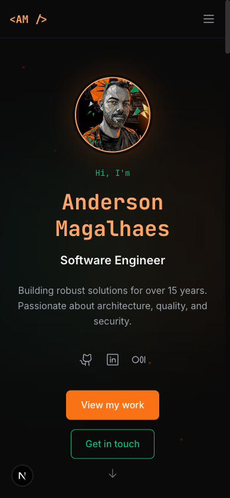 |

### About
A short biography paired with emerald highlight badges summarizing the core specializations: Project Lead, Fullstack, Backend, Infra & Quality, SAST & DAST.

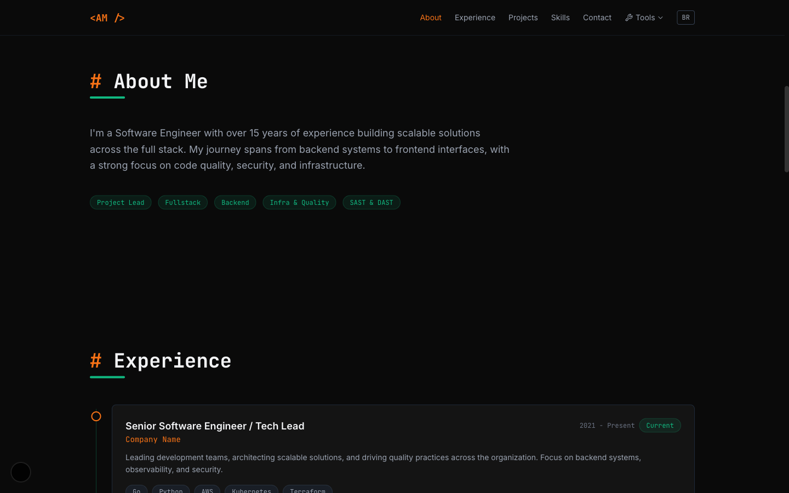

### Experience
A vertical timeline (emerald rail, orange nodes) listing professional roles. Each entry is a hover-aware card with role, company, period, current/past badge, description and tech stack chips.

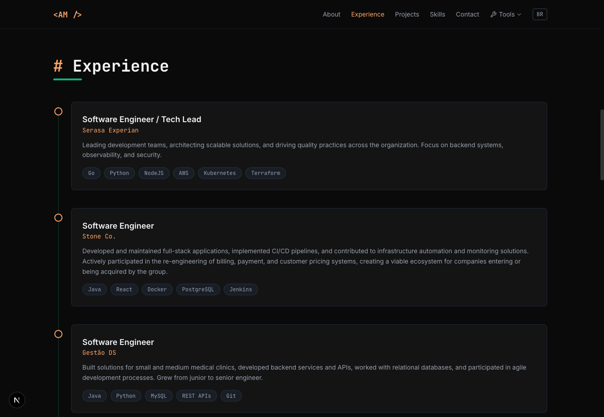

### Projects
A responsive 2-column grid containing the public GitHub repositories alongside each developer tool shipped on this site — every tool doubles as a portfolio item.

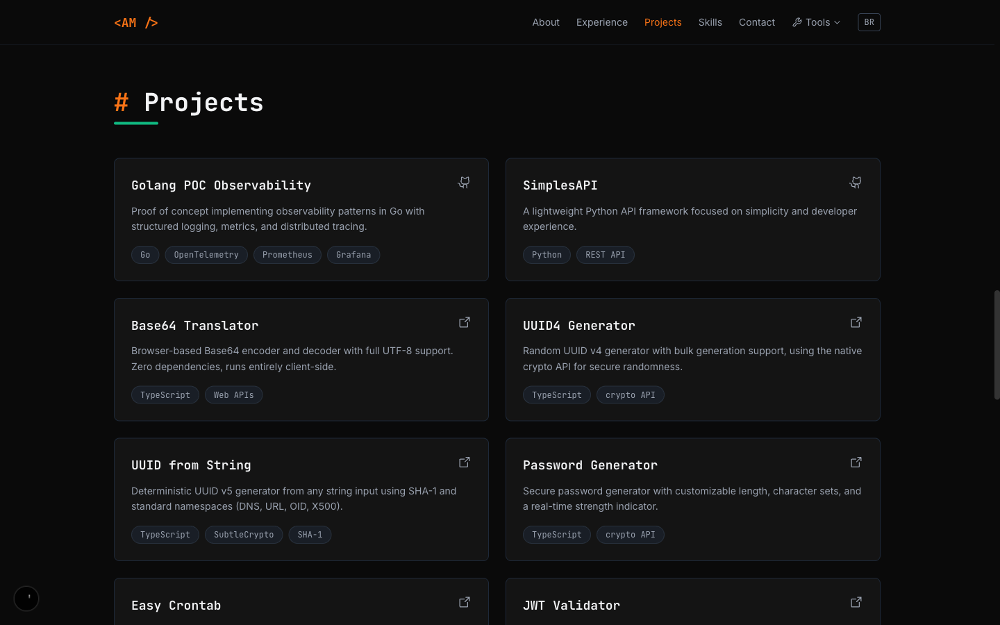

### Skills
Skills grouped by category — Languages, Frameworks, Infrastructure, Tools & Practices, Security — with alternating orange/emerald accents.

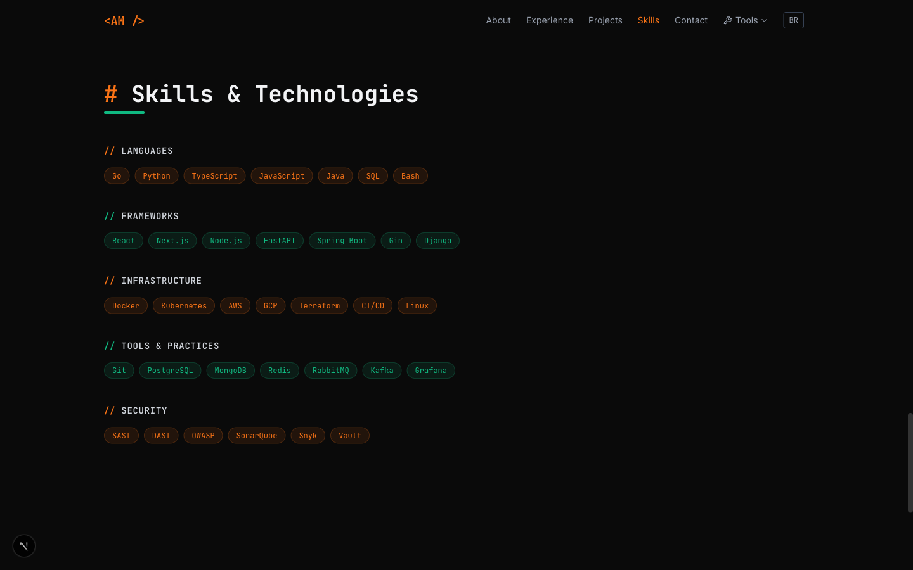

### Contact
Direct links to GitHub, LinkedIn and Medium. No form, no backend — just clear channels.

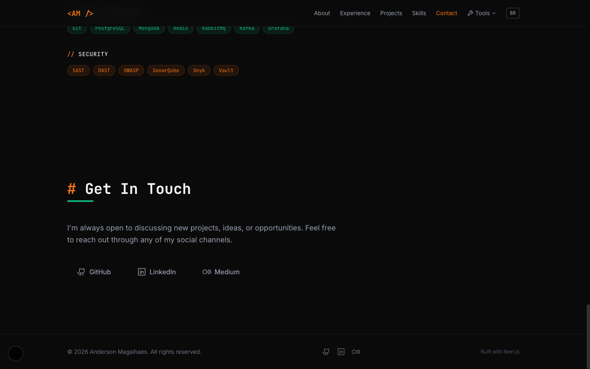

---

## Developer Tools

Eight self-contained, client-side utilities. Each lives at its own route under `/{locale}/<tool>/`, runs entirely in the browser with zero network calls, and shares a consistent layout and copy-to-clipboard UX.

### Base64 Translator — `/base64-translator/`
Encode and decode Base64 strings with full UTF-8 support. Side-by-side input/output, dedicated encode and decode buttons, error handling for invalid input.

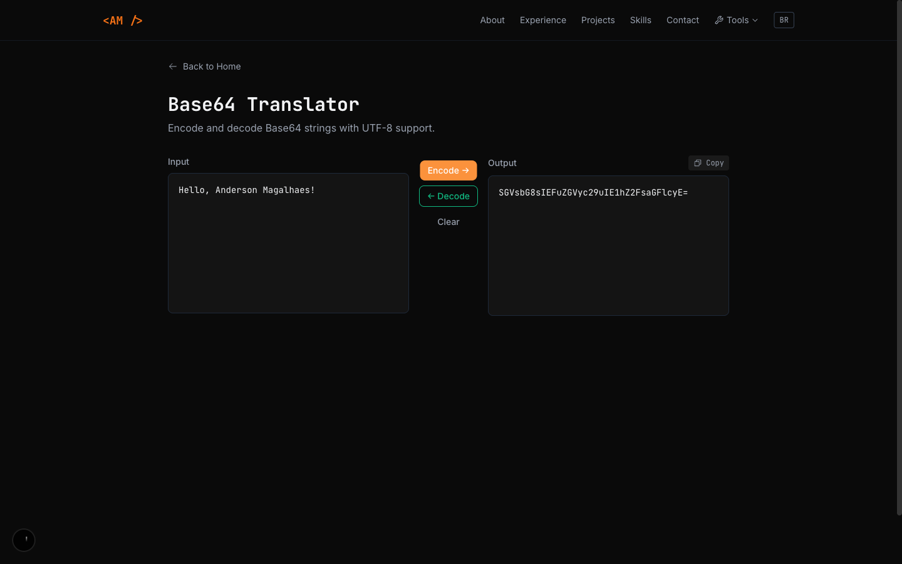

### UUID4 Generator — `/uuid4/`
Generate random UUID v4 identifiers using the native `crypto.randomUUID()` API. Includes a bulk mode for generating up to 100 UUIDs at once with per-row copy buttons.

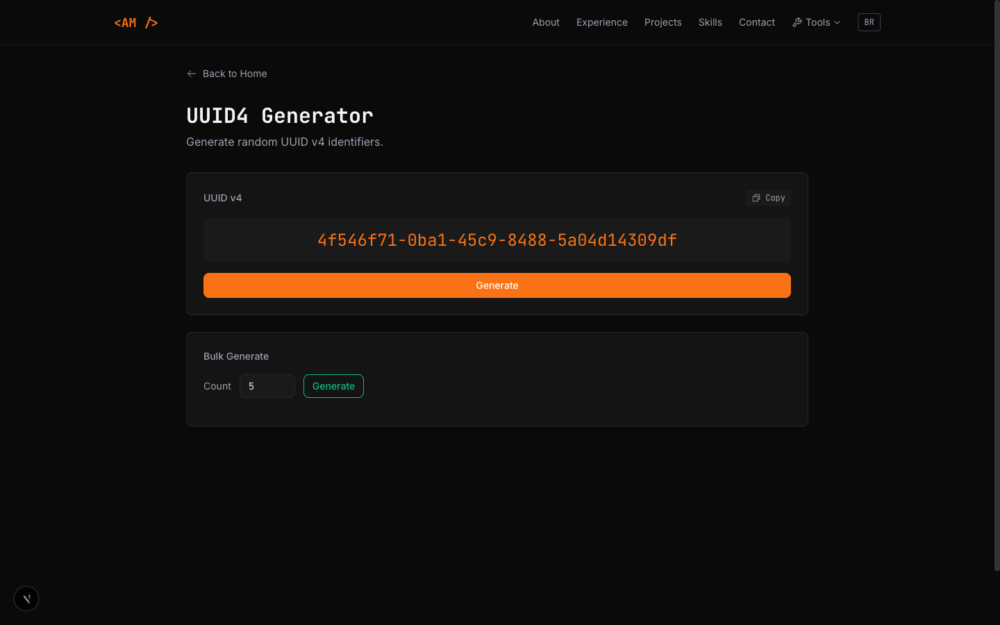

### UUID from String — `/uuid-from-string/`
Deterministic UUID v5 generator from any input string, using the standard DNS, URL, OID and X500 namespaces. Implemented with `SubtleCrypto` SHA-1 and zero dependencies. Auto-generates as you type.

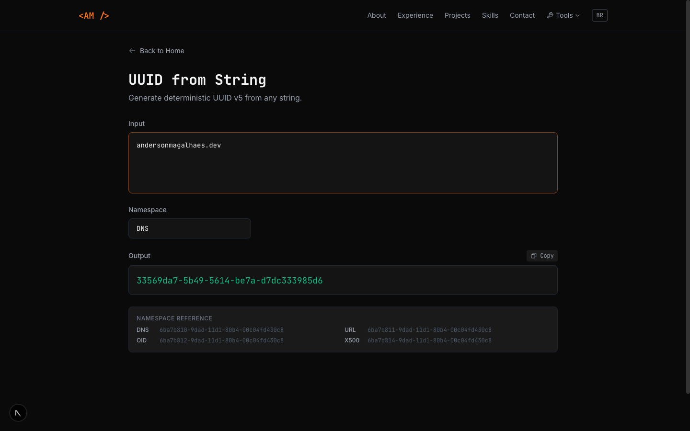

### Password Generator — `/password-generator/`
Cryptographically secure password generator using `crypto.getRandomValues()`. Length slider (8–128), toggleable character sets (uppercase, lowercase, numbers, symbols) and a real-time strength indicator.

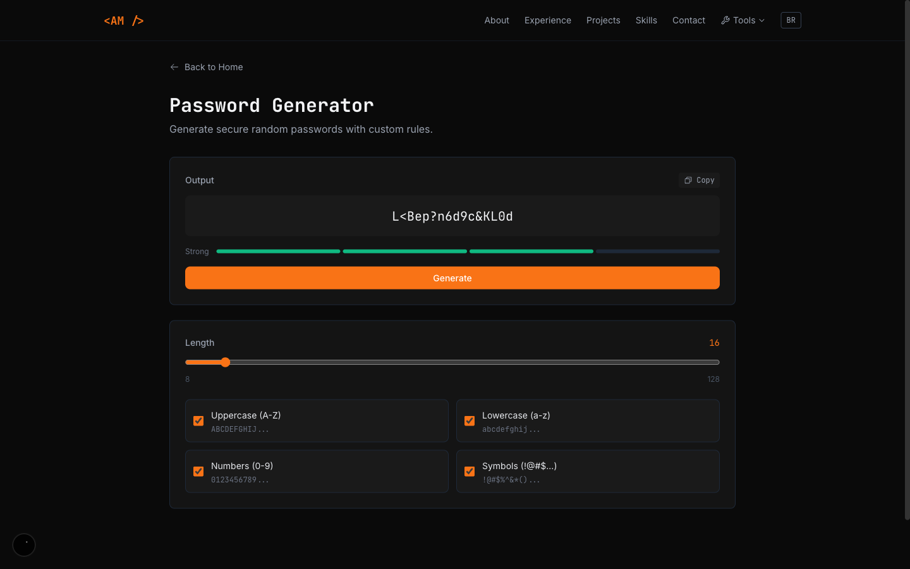

### Easy Crontab — `/easy-crontab/`
Visual cron expression builder with five-field input, human-readable description (fully translated), preset shortcuts, and a preview of the next 5 execution times.

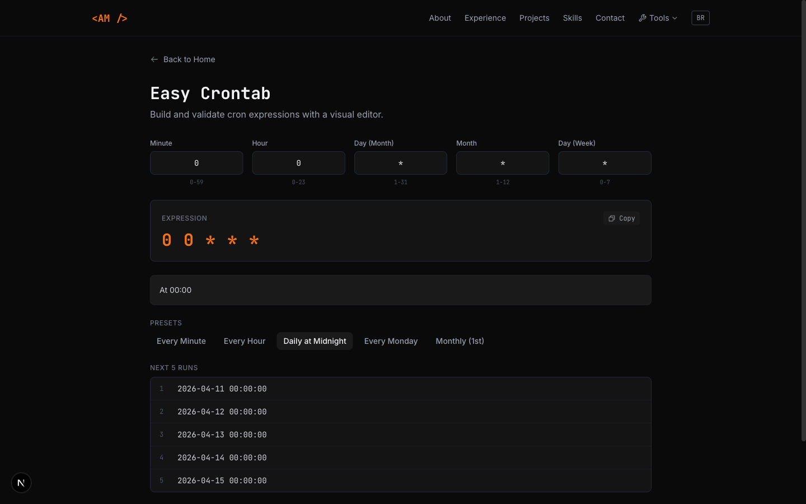

### JWT Validator — `/jwt-validator/`
Decode and inspect JSON Web Tokens. Splits the token into Header, Payload and Signature sections, formats the JSON, and reports expiration status. Powered by the `jose` library.

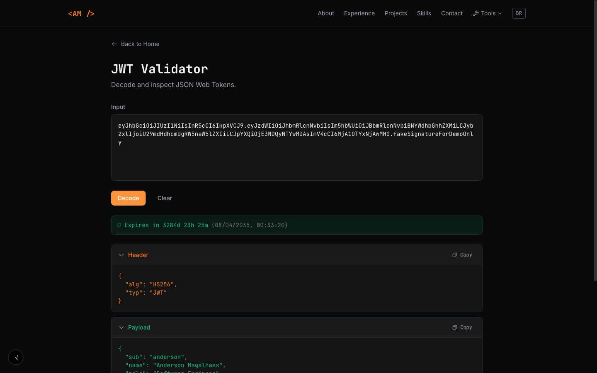

### JSON Validator — `/json-validator/`
Validate, format and minify JSON. Live error reporting with line numbers, prettified output in a monospace block, copy button on the result.

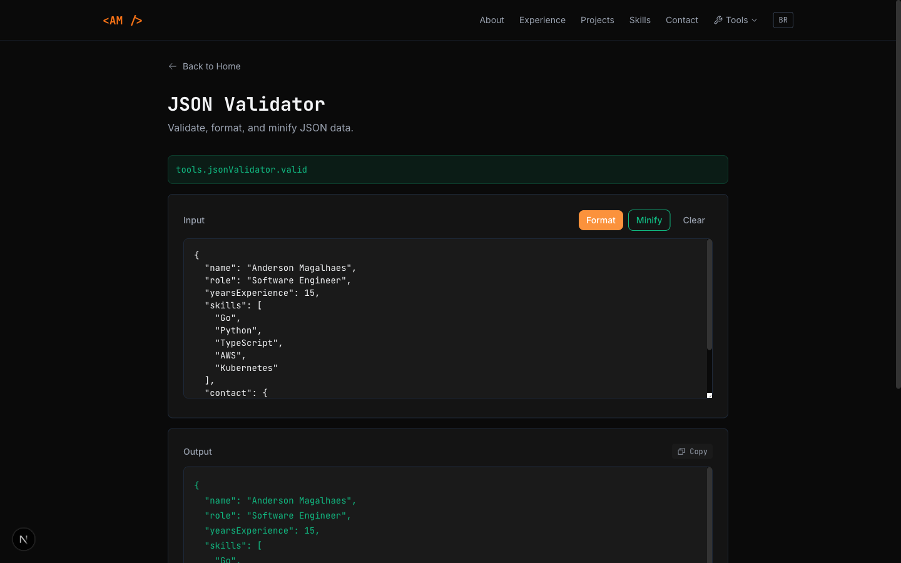

### Text Compare — `/text-compare/`
Side-by-side text diff using the `diff` library. Highlights added lines in emerald, removed in red, with line numbers. Toggle between unified and split views.

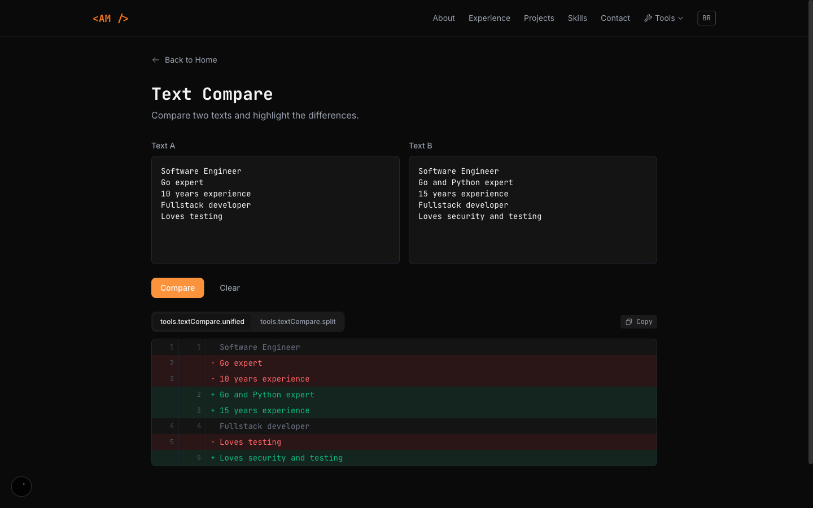

---

## Bilingual (EN / BR)

The entire site — UI strings, project descriptions, experience entries, tool labels, and even the cron description engine — is translated. Switching languages from any page preserves the current route (e.g. `/en/text-compare/` ⇄ `/br/text-compare/`).


The "Tools" dropdown in the header gives quick access to every utility, also localized:


---

## Running Locally

A `Makefile` wraps every common task — run `make` (or `make help`) to list them.

```bash
make install         # install dependencies
make dev             # Next.js dev server  → http://localhost:3000
make storybook       # Storybook dev server → http://localhost:6006
make build           # static export to ./out (postbuild copies .htaccess)
make lint            # ESLint
make test            # Vitest unit tests (When/Then specs in src/lib)
make coverage        # Vitest with coverage (text + html in ./coverage)
make check           # lint + tests + next build + storybook build (CI gate)
make clean           # rm -rf .next out storybook-static coverage
```

The plain `npm run …` scripts still work — `make` is just a thin convenience layer.

The `postbuild` step copies `.htaccess` into `out/` so the bundle can be uploaded as-is to Hostinger `public_html`.

---

## Security pipeline

Three security pillars run on every push to `main` and can be triggered on demand for any branch via the **Run workflow** button on the Actions tab. Any HIGH or higher severity finding fails the pipeline.

| Pillar | Tool | Scope |
|---|---|---|
| **SAST** | Semgrep — `p/owasp-top-ten`, `p/javascript`, `p/typescript`, `p/react` | Source code patterns (XSS, injections, OWASP Top 10) |
| **OWASP** | Trivy `fs` scan — `vuln,secret,misconfig` | npm dependencies, leaked secrets, IaC misconfig |
| **DAST** | OWASP ZAP baseline | The built static export served on `localhost:3000` |

The workflow lives at [`.github/workflows/security.yml`](.github/workflows/security.yml). Triggers:

```yaml
on:
  push:
    branches: [main]
  workflow_dispatch:        # manual run, branch picked from the UI dropdown
```

### Running the same scanners locally

A separate compose file ships SonarQube and Trivy as the local equivalents.

**One-shot SonarQube run:**

```bash
make sonar           # starts SonarQube, waits until healthy, generates coverage,
                     # mints an analysis token via the Sonar API, runs the
                     # scanner, and prints the dashboard URL
```

That single command handles everything: first-run admin-password reset, token creation, coverage generation, and the scan itself. The dashboard becomes available at <http://localhost:9000/dashboard?id=andersonmagalhaes-dev>.

**Granular SonarQube targets:**

```bash
make sonar-up        # start SonarQube and wait for the healthcheck
make sonar-logs      # tail SonarQube logs
make sonar-token     # mint / rotate the analysis token (prints it to stdout)
make sonar-scan      # run sonar-scanner — auto-bootstraps token + coverage
make sonar-down      # stop the container (volumes preserved)
```

`make sonar-scan` honors `SONAR_TOKEN` if it's already exported, otherwise it creates one for you. Override `SONAR_PWD`, `SONAR_URL`, or `SONAR_PROJECT_KEY` on the command line if you need to talk to a different instance.

**Trivy filesystem scan:**

```bash
make trivy-scan      # one-shot Trivy filesystem scan (HIGH/CRITICAL → exit 1)
make security        # local security gate alias (currently runs trivy-scan)
```

The compose file is `docker-compose.security.yml`. Trivy is gated behind the `scan` profile so a plain `up` only starts SonarQube. Sonar settings live in [`sonar-project.properties`](sonar-project.properties) — the scanner reads `coverage/lcov.info` (emitted by `make coverage`) so the dashboard shows code coverage alongside Sonar's own findings.

> SonarQube 9.9 LTS bundles a TypeScript version that doesn't recognize `moduleResolution: bundler` (which Next.js requires). [`tsconfig.sonar.json`](tsconfig.sonar.json) is a small override that swaps in `moduleResolution: node` so the TS sensor can build its program — `sonar-project.properties` points the scanner at it.

### SonarQube dashboard walkthrough

After `make sonar` finishes, point a browser at <http://localhost:9000> and log in with `admin` / `admin-local-1` (the password the Makefile sets on first run — override with `SONAR_PWD=...` if needed).

**1. Login screen** — first thing you see at <http://localhost:9000>.

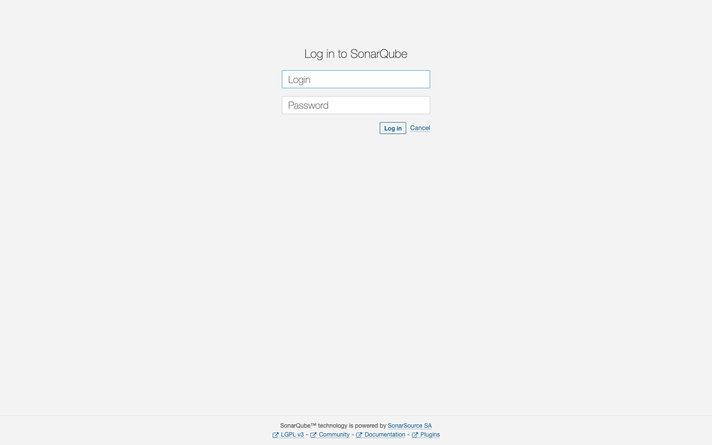

**2. Projects list** — `andersonmagalhaes-dev` shows up after `make sonar` uploads its first analysis. The headline tiles already give you the bug/vulnerability/hotspot/coverage glance.

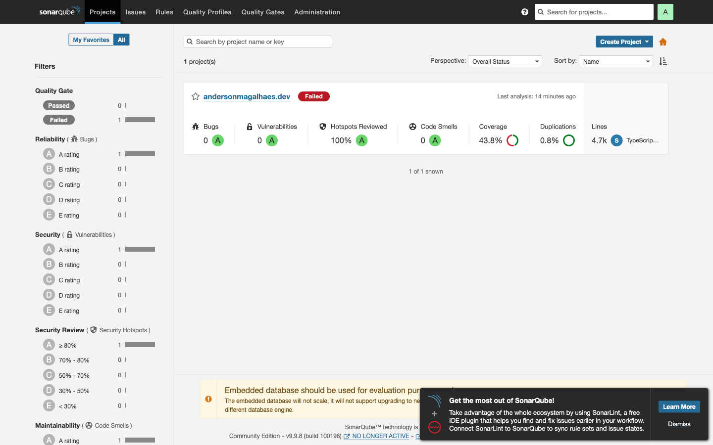

**3. Project overview** — open the project to see the full quality gate breakdown, the new-code vs. overall-code measures, and the activity graph. **Quality gate: Passed** — 0 bugs / 0 vulnerabilities / 100 % hotspots reviewed / 0 code smells / 93.2 % coverage on new code / 0 % duplications, every rating tile **A**.

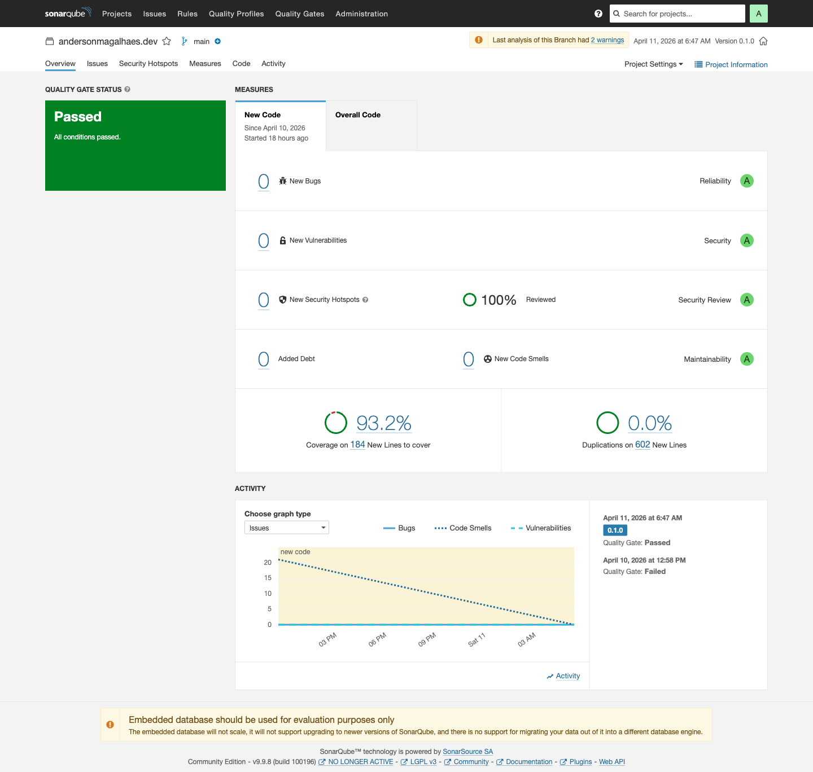

**4. Issues tab** — `Project → Issues` (or directly at `/project/issues?id=andersonmagalhaes-dev&resolved=false`). Empty: **0 bugs, 0 vulnerabilities, 0 code smells**.

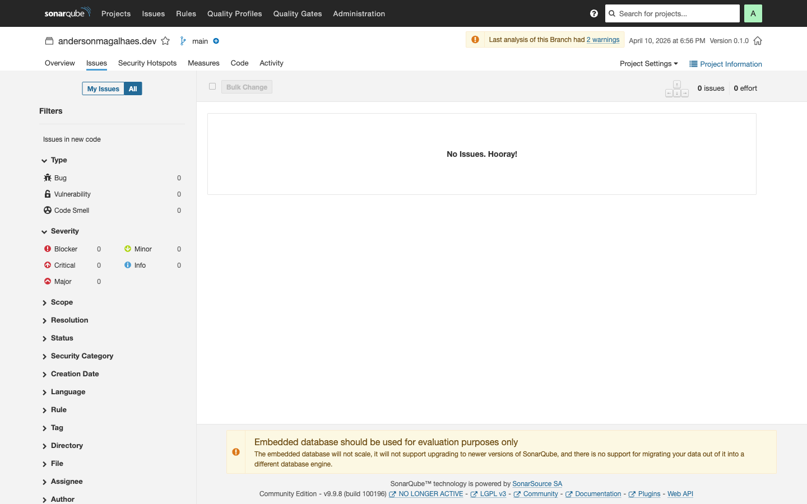

**5. Coverage on New Code** — `Project → Measures → Coverage on New Code` lists each file's contribution to the new-code coverage metric. The lib modules (`text-compare.ts`, `cron.ts`, `base64.ts`) are at 100 %; the remaining uncovered lines all live in the React `client.tsx` files (presentational JSX, no business logic).

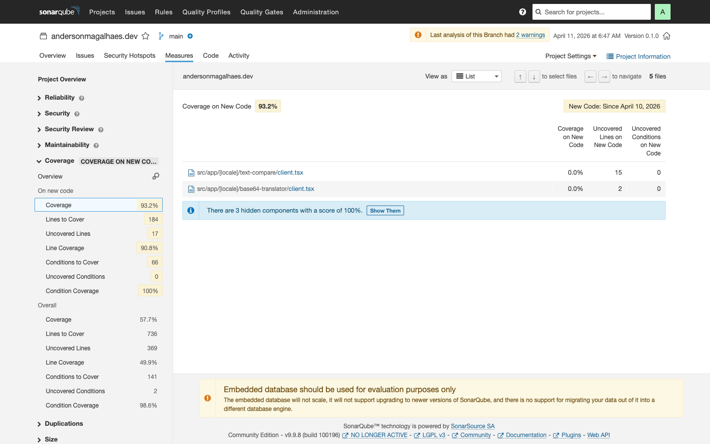

**Quick checklist for verifying the project is healthy:**

1. Run `make sonar` — wait for `✓ Dashboard:` line.
2. Open <http://localhost:9000/dashboard?id=andersonmagalhaes-dev>.
3. **Quality Gate** card → confirm it shows **Passed** and every rating tile is **A**.
4. If the gate is ever red, click into **Coverage on New Code** — the file list will tell you exactly which files need more tests (see [Test architecture & coverage](#test-architecture--coverage) below).
5. If everything looks good, `make sonar-down` to free up resources.

#### Test architecture & coverage

The unit-test suite uses **Vitest in node mode** (no jsdom) and targets `src/lib/**` exclusively. The pattern is consistent across every browser tool on the site: pure logic lives in a lib module with a co-located `When/Then` spec, and the `"use client"` React component imports from there.

| Module | Lib file | Spec |
|---|---|---|
| Easy Crontab — describer + iterator | `src/lib/cron.ts` | `cron.test.ts` |
| Password Generator | `src/lib/password.ts` | `password.test.ts` |
| UUID v5 from string | `src/lib/uuid.ts` | `uuid.test.ts` |
| JSON Validator | `src/lib/json-validate.ts` | `json-validate.test.ts` |
| Text Compare — diff helpers | `src/lib/text-compare.ts` | `text-compare.test.ts` |
| Base64 Translator — encode/decode | `src/lib/base64.ts` | `base64.test.ts` |
| `cn()` class merger | `src/lib/cn.ts` | `cn.test.ts` |

Current numbers (`make coverage`):

```
File              | % Stmts | % Branch | % Funcs | % Lines
------------------|---------|----------|---------|---------
All files         |    100  |   98.58  |    100  |    100
 base64.ts        |    100  |    100   |    100  |    100
 cn.ts            |    100  |    100   |    100  |    100
 cron.ts          |    100  |   98.61  |    100  |    100
 json-validate.ts |    100  |   83.33  |    100  |    100
 password.ts      |    100  |    100   |    100  |    100
 text-compare.ts  |    100  |    100   |    100  |    100
 uuid.ts          |    100  |    100   |    100  |    100

83 tests passing.
```

In Sonar, `new_coverage` lands at **93.2 %** — the only uncovered "new" lines are the JSX rendering paths inside the React client files (`text-compare/client.tsx`, `base64-translator/client.tsx`), which would require `@testing-library/react` + a jsdom environment to exercise. That's well above the Sonar Way 80 % threshold and the gate is **Passed**.

If a future change touches one of the `client.tsx` files heavily and pushes new-code coverage back below 80 %, the playbook is:

1. **Move the new logic into the corresponding `src/lib/*.ts` module** and add `When/Then` tests for it — this is what every browser tool already does and it's the cleanest path back to green.
2. **Or bump `sonar.projectVersion`** in `sonar-project.properties` (e.g. `0.1.0` → `0.1.1`). Sonar rolls the "Previous Version" period forward and "new code" becomes empty until the next change — useful when you've consciously decided the current state is the new baseline.
3. **Or customise the quality gate** in the Sonar UI (`Quality Gates` → clone the Sonar way → relax `Coverage on New Code`). Reasonable for a personal portfolio where presentational components don't carry meaningful logic.

## Styling architecture

There is no Tailwind, no PostCSS plugin, no utility-class soup. Everything is plain CSS, organized in two layers:

```
src/styles/
├── tokens.css      # ← single source of truth: colors, spacing, fonts,
│                   #   radii, shadows, transitions, breakpoints, z-index
└── globals.css     # @imports tokens; reset, body, scrollbar, shared
                    # layout utilities (.container, .container-tool, .section)
```

To restyle the site you only edit `tokens.css` — every component reads from CSS variables, so a single value change cascades everywhere.

Each component owns a co-located **CSS Module** (`Button.module.css`, `Header.module.css`, …). Tool clients additionally share `src/app/[locale]/tools.module.css` which exposes reusable primitives — `.panel`, `.field`, `.input`, `.textarea`, `.eyebrow`, `.errorBox`, `.actionRow` and friends — so the eight tool pages stay DRY without duplicating layout decisions.

The `cn()` helper in `src/lib/cn.ts` is a one-line `clsx` wrapper for combining module class names conditionally.

---

## Storybook

Every component lives in **Storybook 10** (`@storybook/nextjs`) so it can be developed, reviewed and demoed in isolation. Stories cover the three component layers — `ui/`, `layout/` and `sections/` — and the preview is wired with Tailwind v4, the dark theme background, and a `NextIntlClientProvider` decorator that uses the real `en.json` / `br.json` message bundles. A locale switcher in the toolbar lets you flip every story between English and Portuguese.

```bash
npm run storybook         # http://localhost:6006
npm run build-storybook   # static build into ./storybook-static
```

### UI primitives

| | |
|---|---|
| `Button` — variants, sizes, disabled | `Badge` — orange / emerald / gray |
|  | 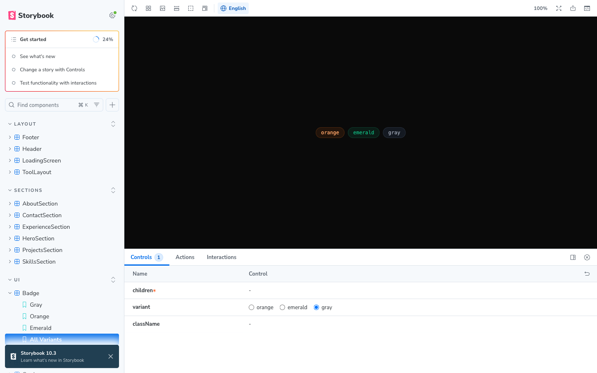 |
| `Card` — base container used across the site | `ToolLayout` — shared shell for every developer tool |
| 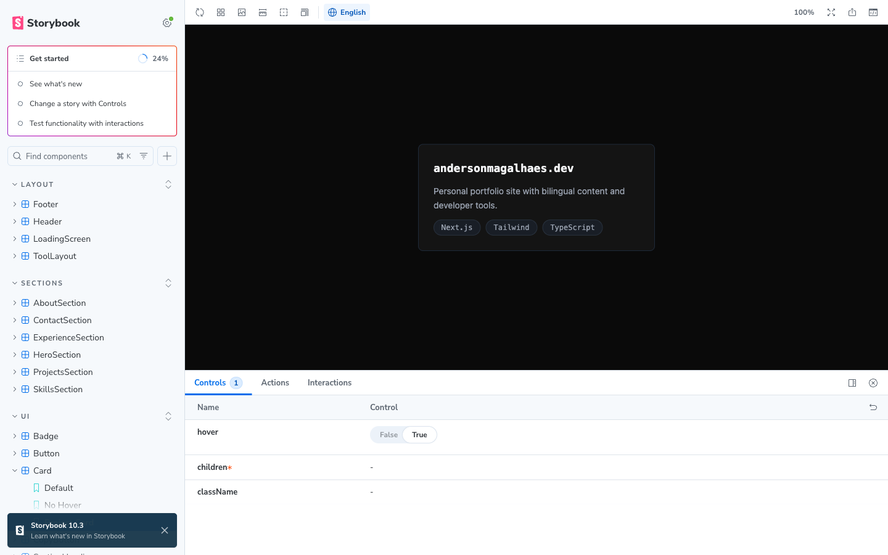 | 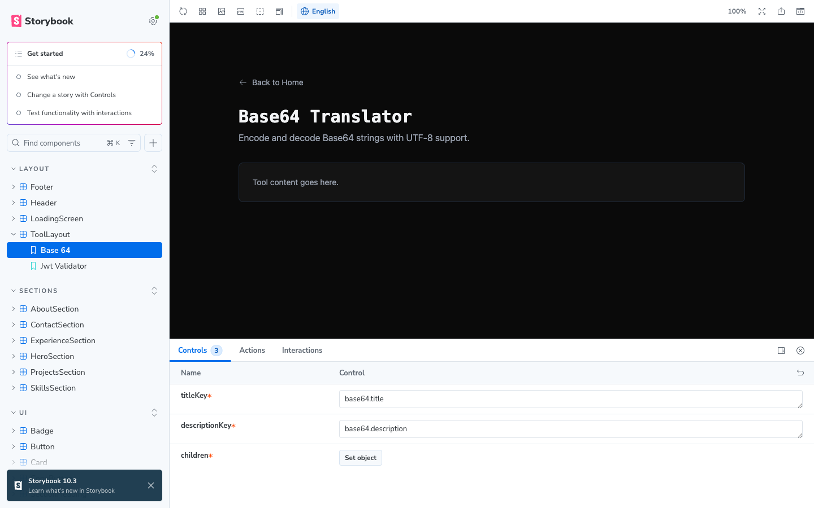 |

### Layout

The fixed header is rendered with the Next.js navigation mock, including the active-section state and the Tools dropdown.

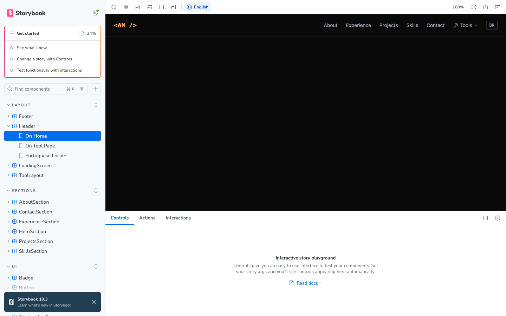

### Sections

Every landing-page section is a standalone story, rendered against the live `next-intl` messages.

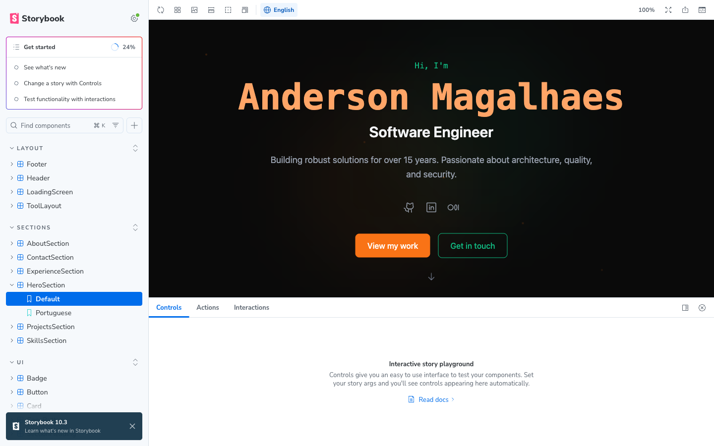

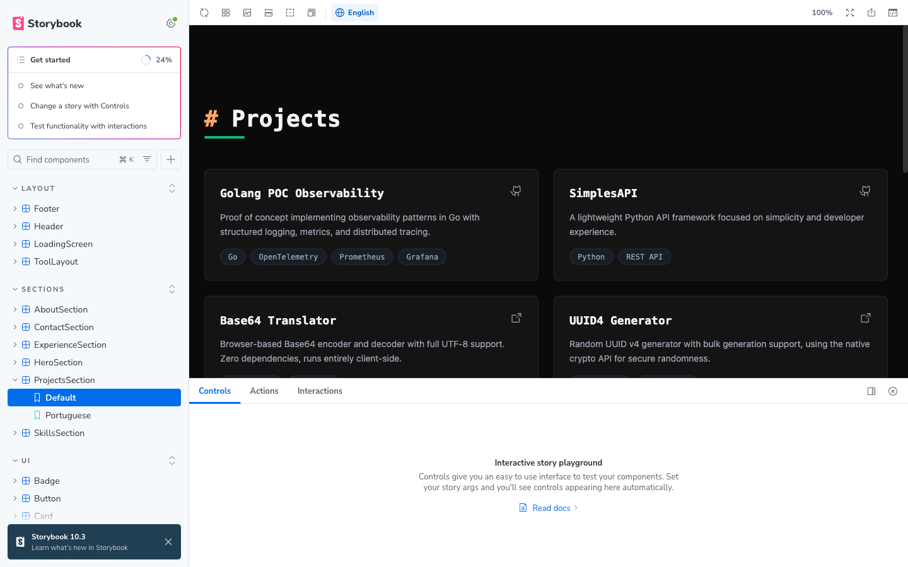

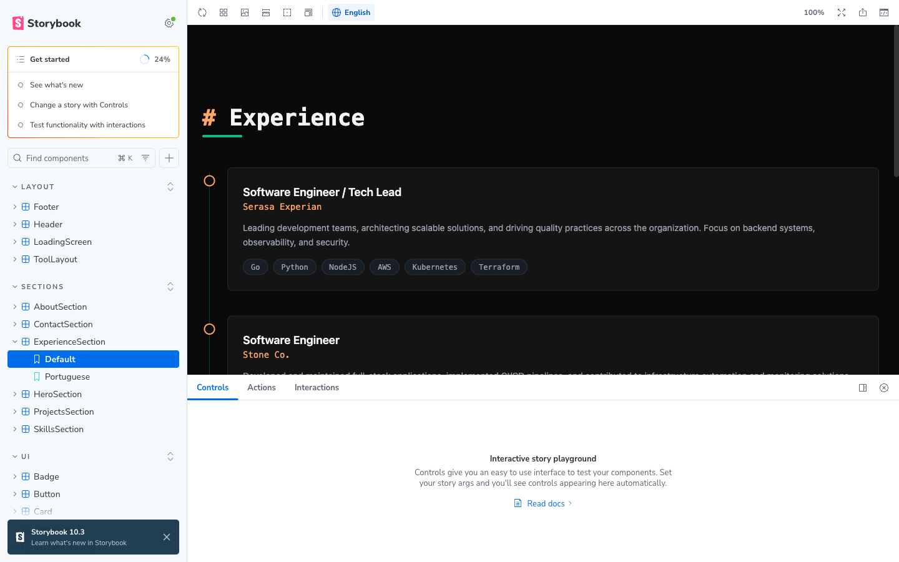

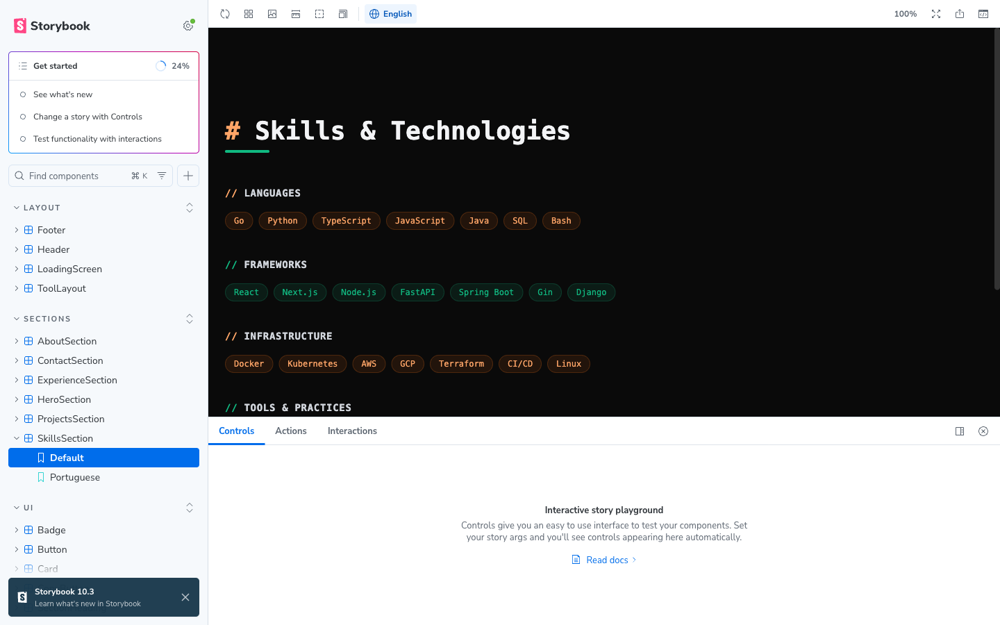

### Locale switching

The same `Hero` story rendered with the toolbar locale flipped to **Português (BR)** — proof that the `NextIntlClientProvider` decorator picks up the active globals.

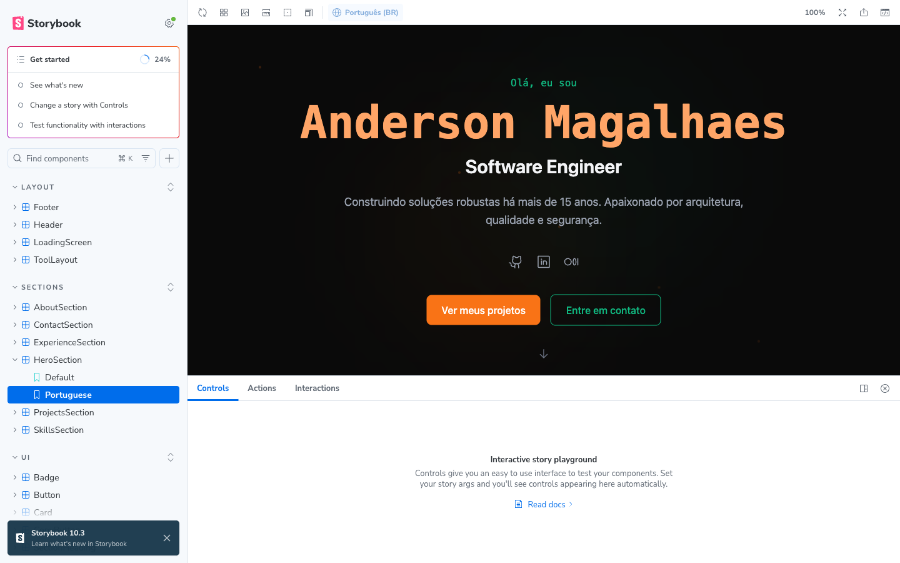

---

## Project Structure

```
.
├── Makefile                     # task runner (make help)
├── .storybook/
│   ├── main.ts
│   ├── preview.tsx              # globals.css + NextIntlClientProvider decorator
│   └── preview-head.html        # loads Inter + JetBrains Mono for Storybook
├── src/
│   ├── styles/
│   │   ├── tokens.css           # design tokens (single source of truth)
│   │   └── globals.css          # reset + .container/.section utilities
│   ├── app/
│   │   ├── [locale]/            # Localized routes (en, br)
│   │   │   ├── layout.tsx
│   │   │   ├── page.tsx         # Landing page
│   │   │   ├── tools.module.css # shared CSS primitives for every tool
│   │   │   ├── base64-translator/  (client.tsx + Base64.module.css)
│   │   │   ├── uuid4/              (client.tsx + Uuid4.module.css)
│   │   │   ├── uuid-from-string/   (client.tsx + UuidFromString.module.css)
│   │   │   ├── password-generator/ (client.tsx + Password.module.css)
│   │   │   ├── easy-crontab/       (client.tsx + Crontab.module.css)
│   │   │   ├── jwt-validator/      (client.tsx + Jwt.module.css)
│   │   │   ├── json-validator/     (client.tsx + Json.module.css)
│   │   │   └── text-compare/       (client.tsx + TextCompare.module.css)
│   │   ├── layout.tsx           # Root layout (fonts, base metadata)
│   │   └── page.tsx             # Redirects to /en/
│   ├── components/              # each component co-locates a .module.css
│   │   │                        # and a .stories.tsx
│   │   ├── layout/              # Header, Footer, ToolLayout, LoadingScreen
│   │   ├── sections/            # Hero, About, Experience, ...
│   │   └── ui/                  # Button, Badge, Card, CopyButton, ...
│   ├── data/                    # experience, projects, skills, social
│   ├── hooks/                   # useActiveSection, useCopyToClipboard
│   ├── i18n/
│   │   ├── routing.ts
│   │   ├── request.ts
│   │   └── messages/{en,br}.json
│   └── lib/cn.ts                # one-line clsx wrapper
```

---

## Notes

- All routes are statically generated (`output: "export"`).
- All developer tools run client-side only — no API routes, no server, no telemetry.
- Hydration-safe: anything that depends on `crypto.randomUUID()`, `new Date()` or locale-specific formatting runs inside `useEffect`.
- The "decrypting" loader on first visit is gated by `sessionStorage` so it only plays once per tab.
